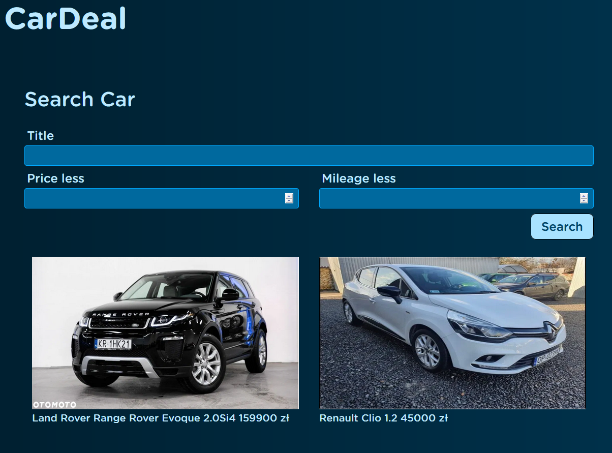
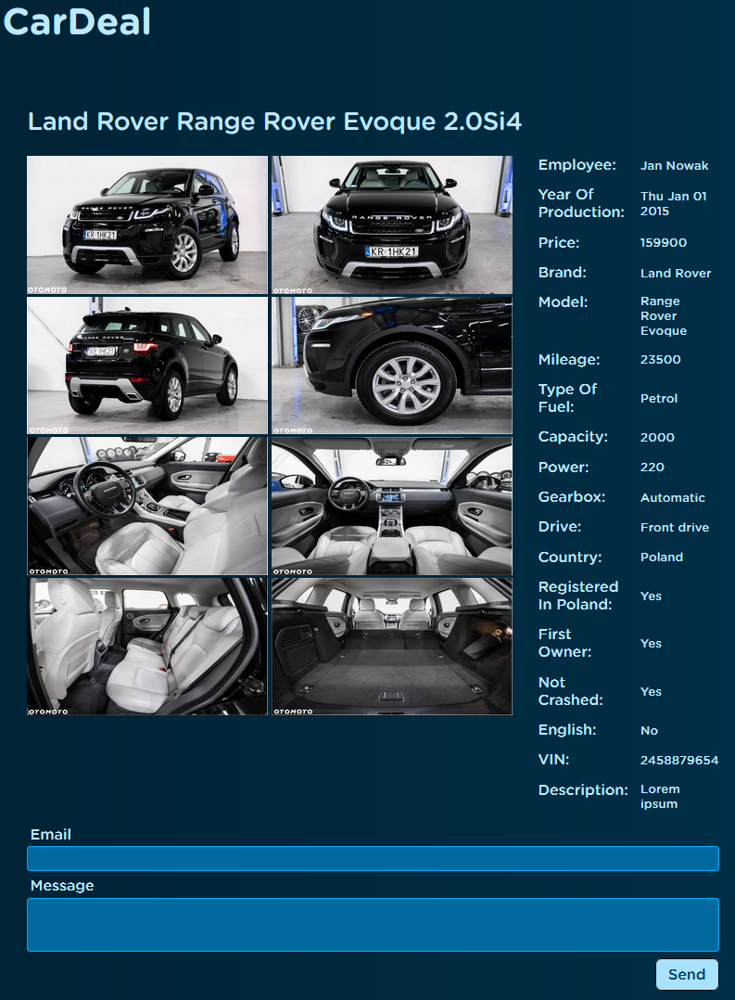
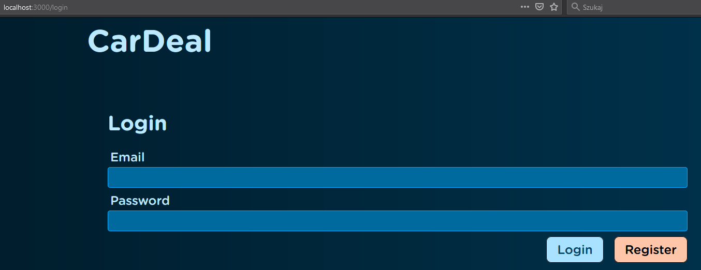
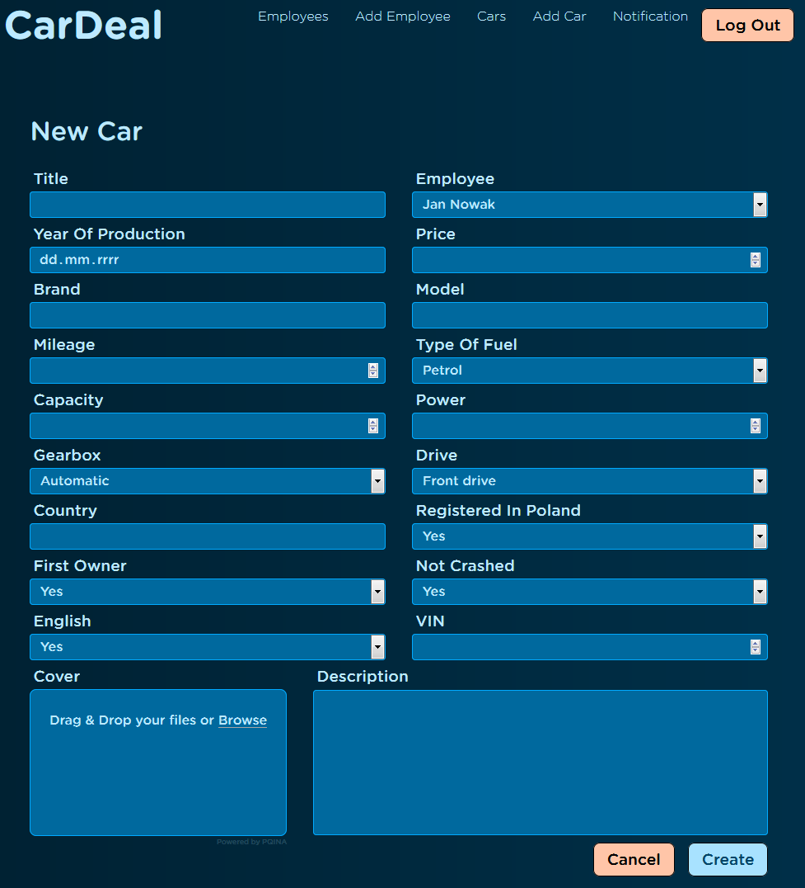

# CarDeal

## Description
An application that includes a client panel and an administrator panel. It handles registration, login, adding employees and cars. You can add car details and photos. Client can filter cars and send message to car dealer.

## Technologies
* JavaScript
* Node.js
* Express
* MongoDB
* REST API

## Presentation

### Client:

### Login:

### Admin:

## Setup
To run this project:
1. Install Node.js and MongoDB on your computer,
2. In the project folder (in Visual Studio Code or cmd) run the command `npm install` - This will install the dependencies inside `node_modules`,
3. Then run the command `nodemon server.js`,
4. Open (http://localhost:3000) to view it in the browser.